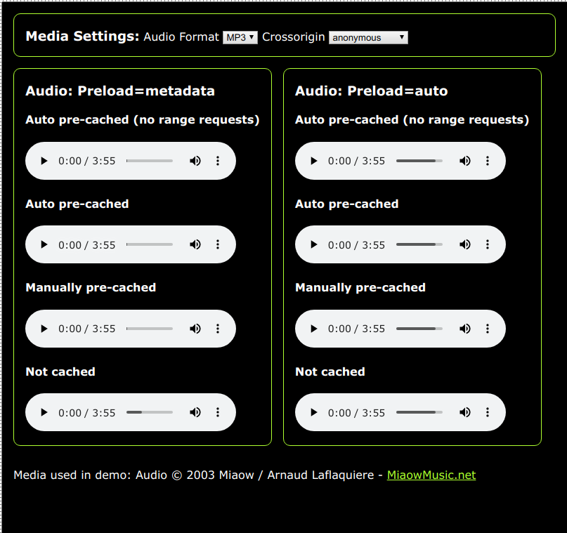
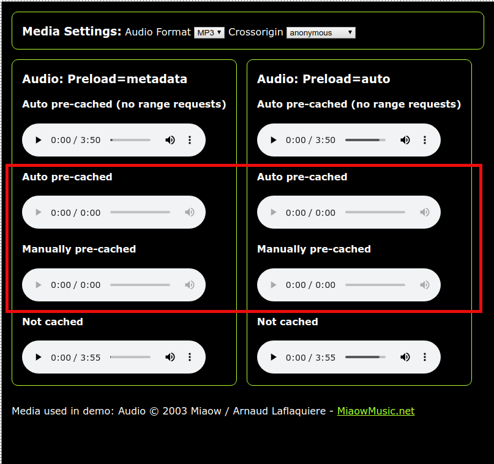

# Media Cache Test
PWA test project to find out how to get audio caching working with [Workbox](https://developers.google.com/web/tools/workbox), 
including scrub/seek using the [range requests plugin](https://developers.google.com/web/tools/workbox/modules/workbox-range-requests).

I want the app to precache all audio and for this audio to be playable offline, including scrub/seek.

Pre-caching the audio can be done in one of two ways:
1. Using [Workbox injectManifest](https://developers.google.com/web/tools/workbox/modules/workbox-cli#injectmanifest).
1. By manually adding audio files to a cache using ```cache.add(URL)```

See ```sw.js``` for how to do both types of pre-caching.

But audio files cached with the first method (injectManifest) will not scrub/seek because the Workbox pre-cache does not
support range request headers. So you need to put a range request enabled router in front of the 
pre-cache for audio files if you want to be able to scrub through/seek within a cached audio file.

This app is currently deployed on Firebase: https://daffinm-test.firebaseapp.com/

### Summary of results
Pre-cached audio with a range requests enabled router play and scrub/seek fine in Chrome and Firefox when app is served 
from localhost but fail to play in Chrome when served from Firebase. Firefox works fine in both cases.

Detailed test setup, expectations and results are below.

## Latest news

* App has been updated to add video and to enable experimentation with different audio formats and preload settings to 
see if any of this makes a difference. It does not seem to.

## Background reading
* https://developers.google.com/web/tools/workbox/guides/advanced-recipes#cached-av 
* https://stackoverflow.com/questions/57903010/cannot-scrub-scroll-through-jplayer-audio-when-mp3-is-cached-by-workbox/57913561#57913561

## Test setup
The app contains 2 groups of 4 audio elements: 
* Group 1: preload=metadata
* Group 2: preload=auto

I wanted to see what difference the preload setting made to the behaviour.

Each of the 4 audio elements has different cache configuration:
1. __Auto-pre-cached (no range requests):__ audio file has been pre-cached using ```injectManifest``` but is __not__ 
configured with a range request router in front of it.
1. __Auto-pre-cached:__ audio file has been pre-cached using ```injectManifest``` and is configured with a range requests
router in front of it.
1. __Manually pre-cached:__ audio file has been pre-cached using ```cache.add(url)``` and is configured with a range requests
router in front of it.  
1. __Not cached:__ audio file is not cached.

## Test expectations
* Online tests are performed after loading the app.
* Offline tests are performed after killing the network connection and local server (localhost testing), 
closing the tab in which the app is running and then re-opening it.
##### Auto-pre-cached (no range requests):
1. Should be playable online or offline.
1. Should __not__ be able to seek/scrub.
##### Auto-pre-cached:
1. Should be playable online or offline.
1. Should be able to seek/scrub.
##### Manually pre-cached: 
1. Should be playable online or offline.
1. Should be able to seek/scrub.
##### Not cached: 
1. Should be playable online but __not__ offline.
1. Should be able to seek/scrub when online since file is being fetched directly from a server that will support range requests.

## Test results
### Firefox
  ```
   Mozilla/5.0 (X11; Ubuntu; Linux x86_64; rv:69.0) Gecko/20100101 Firefox/69.0
  ```
#### On localhost with [npm http-server](https://www.npmjs.com/package/http-server) and on [Firebase](https://daffinm-test.firebaseapp.com/).
Results are the same in both cases and for both preload=metadata and preload=auto
##### Auto-pre-cached (no range requests):
1. PASS
1. FAIL: I can scrub/seek (I suppose the audio has been buffered by Firefox)
##### Auto-pre-cached:
1. PASS
1. PASS
##### Manually pre-cached: 
1. PASS
1. PASS
##### Not cached: 
1. PASS
1. PASS

### Chrome with app on localhost
Separate results for localhost and Firebase since these differ on Chrome. Tested on latest version of Chrome on 
Ubuntu 18.04 and Windows 10.
```
Mozilla/5.0 (X11; Linux x86_64) AppleWebKit/537.36 (KHTML, like Gecko) Chrome/77.0.3865.90 Safari/537.36
Mozilla/5.0 (Windows NT 10.0; Win64; x64) AppleWebKit/537.36 (KHTML, like Gecko) Chrome/77.0.3865.90 Safari/537.36
```

##### Auto-pre-cached (no range requests):
1. PASS
1. PASS
##### Auto-pre-cached:
1. PASS
1. PASS
##### Manually pre-cached: 
1. PASS
1. PASS
##### Not cached: 
1. PASS
1. PASS

### Chrome with app on Firebase
Now we start seeing some really odd things... in summary:
* When online, after initial page load all files are playable and scrub/seekable, including the pre-cached file that 
does not have a range requests router (odd: why is this different from when running on localhost?)

  

* If I then reload/refresh the page whilst still online I start seeing errors in the workbox log for all files that 
have range request routers:
```
Router is responding to: /media/audio/auto-pre-cached.mp3
Using CacheOnly to respond to '/media/audio/auto-pre-cached.mp3'
    No response found in the 'act-auto-pre-cache-wbv4.3.1-actv0.0.1' cache.
    The FetchEvent for "https://daffinm-test.firebaseapp.com/media/audio/auto-pre-cached.mp3" resulted in a network error response: the promise was rejected.
    CacheOnly.mjs:115 Uncaught (in promise) no-response: The strategy could not generate a response for 'https://daffinm-test.firebaseapp.com/media/audio/auto-pre-cached.mp3'.
        at CacheOnly.makeRequest (https://storage.googleapis.com/workbox-cdn/releases/4.3.1/workbox-strategies.dev.js:343:15)
```
  

* If I then unregister the service worker and refresh the page a new service worker instance is activated and 
I am able to play all the pre-cached audio files fine.
* When offline the pre-cached file with no range request router plays fine but the other pre-cached audio files 
don't. The errors in the workbox logs are the same as when online after refresh (see above). 


## Editing, testing and debugging the app locally
1. Edit the files in the  ```www/``` directory.
1. Open a console in the project root, install the npm packages and run the local dev server:
   ```
   $ npm install
   $ npm start 
   ```
1. Run the build (syncs ```www/``` to ```www-deploy/```): 
   ```
   $ ./build
   ```
1. Goto http://localhost:8080

## Switch Workbox versions?
You can switch Workbox versions easily for testing purposes by updating 
```workbox-src/sw.js```

```$xslt
const WorkboxVersions = Object.freeze({
    V4: "4.3.1",
    V5: "5.0.0-beta.0"
});
const WORKBOX_DEBUG = true;
const WORKBOX_VERSION = WorkboxVersions.V4;
```
Currently, Workbox 4 seems more reliable. Cached audio files with range request routers 
are playable when the app is served from a local dev server (online of offline) and only become
problematic when you deploy to Firebase. 

On the other hand, with Workbox 5, cached audio
with range request routers are unplayable when served from localhost or Firebase (online or offline). 
